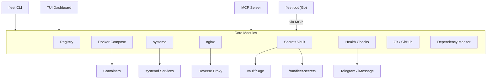
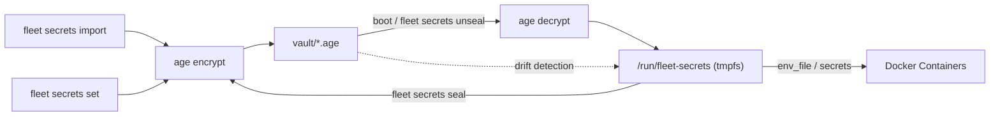
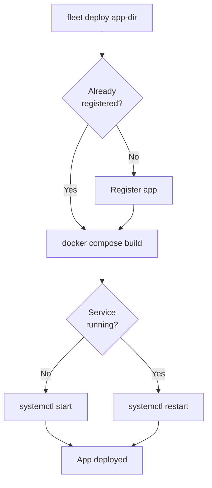

<div align="center">

# fleet

[](https://auto-audit.hesketh.pro)

**Docker production management CLI + MCP server**

[](https://github.com/wrxck/fleet/actions/workflows/ci.yml)
[](https://www.npmjs.com/package/@matthesketh/fleet)
[](https://nodejs.org)
[](https://www.typescriptlang.org/)
[](LICENSE)

Manage Docker Compose apps on a single server -- systemd orchestration, nginx routing, age-encrypted secrets, health monitoring, dependency tracking, Git workflows, and an MCP server for AI-assisted operations.

[Documentation](https://fleet.hesketh.pro) -- [npm](https://www.npmjs.com/package/@matthesketh/fleet) -- [GitHub](https://github.com/wrxck/fleet)

</div>

---

## Architecture



Each Docker Compose app is registered with its compose path, domains, port, and container names. Fleet generates systemd units so apps start on boot in the correct order. Secrets are encrypted at rest with [age](https://github.com/FiloSottile/age) and decrypted to a tmpfs on boot.

## Install

```bash
npm install -g @matthesketh/fleet
```

Requires Node.js 20+, Docker Compose v2, systemd, nginx, and [age](https://github.com/FiloSottile/age). See the [full setup guide](https://fleet.hesketh.pro/getting-started/) for details.

## Key Features

**Deploy and manage apps** -- `fleet deploy <app-dir>` registers, builds, and starts an app in one command. Control services with `start`, `stop`, `restart`, and `logs`.

**Encrypted secrets** -- age-encrypted vault with automatic backups, pre-seal validation, drift detection, and atomic rollback. Decrypted to tmpfs at boot -- secrets never touch disk.

**Nginx routing** -- Generate proxy, SPA, or Next.js server blocks with `fleet nginx add`. Automatic config testing and reload.

**Health monitoring** -- Three-layer checks (systemd + container + HTTP) with `fleet health`. The `watchdog` command runs on cron and sends alerts on failure.

**Dependency scanning** -- Detects outdated packages, CVEs (via OSV), Docker image updates, and runtime EOL across all registered apps.

**Git workflows** -- Onboard apps to GitHub, manage branches, PRs, and releases from the CLI.

**Interactive dashboard** -- Run bare `fleet` to launch a full-screen TUI with real-time status.

See the [CLI reference](https://fleet.hesketh.pro/cli/) for the complete command list.

## Secrets Flow



Secrets are imported or set individually, encrypted with age, and stored in the vault. On boot (or manually), they are decrypted to a tmpfs mount that Docker containers reference. Sealing writes runtime changes back to the vault. Drift detection compares vault vs runtime to catch unsaved changes.

### Per-secret rotation (v1.6)

Each secret carries metadata (`lastRotated`, `provider`, `strategy`) so fleet knows when it's stale and how to safely rotate it.

```
fleet secrets ages [<app>]            # what's stale, who owns it, when last rotated
fleet secrets ages --motd             # MOTD-formatted summary
fleet secrets motd-init               # install /etc/update-motd.d/99-fleet-secrets

fleet secrets rotate <app> [<KEY>]    # interactive walkthrough, [--dry-run] [--no-restart]
fleet secrets rollback <app>          # restore latest snapshot, [--to <ts>]
fleet secrets snapshots <app>         # list available snapshots
fleet secrets rotate-key              # legacy: rotate the AGE master key
```

Rotation strategies (auto-detected from secret name, see `src/core/secrets-providers.ts`):

| Strategy | Examples | Behaviour |
|---|---|---|
| `immediate` | `STRIPE_SECRET_KEY`, `GITHUB_TOKEN`, `OPENAI_API_KEY` | Replace value, old dies |
| `dual-mode` | `JWT_SECRET`, `NEXTAUTH_SECRET`, `SESSION_SECRET` | New becomes primary, **old kept as `<NAME>_PREVIOUS`** so existing user sessions stay valid through grace period (your app must read both for verification) |
| `at-rest-key` | `ENCRYPTION_KEY`, `FIELD_ENCRYPTION_KEY` | Refused unless `--data-migrated` passed (you must re-encrypt stored data first) |
| `user-issued` | `USER_API_TOKEN`, `CUSTOMER_API_KEYS` | Refused — rotate per-user inside your app |

Safety rails on every rotation:
- Pre-rotation snapshot to `vault/.snapshots/<app>-<ts>.env.age` (atomic copy+rename)
- Hidden input prompt; new value never echoed in full (only `prefix…suffix (N chars)` for confirmation)
- Format validation against provider regex (catches paste typos)
- Entropy check rejects placeholders (`changeme`, `password`, all-same-char, < 8 chars)
- Auto-rollback on any failure during reseal
- Restart + 5s healthcheck gate after re-unseal; manual `fleet rollback` always available
- Append-only audit log at `~/.local/share/fleet/audit.jsonl` (mode 0600, never logs values)

### Log lifecycle (v1.6)

```
fleet logs setup <app>                # interactive: retention/size/level
fleet logs setup --all                # bulk default (7d / 100MB / info)
fleet logs status [<app>]             # per-container size, driver, policy applied
fleet logs prune <app>                # vacuum journald + truncate runaway json-file logs
fleet logs <app> --since 30m --grep err --level warn   # filtered tail
```

`fleet logs setup` writes `<composePath>/.fleet/logging.override.yml` with json-file driver options for rotation. To activate, include the override in your compose start command (or fleet's systemd unit).

MCP tools — all token-conservative with small defaults and `truncated` flags:
- `fleet_logs_recent(app, lines=50, level=warn, sinceMinutes=15)` — bounded tail
- `fleet_logs_summary(app, sinceMinutes=60)` — counts + top 10 distinct error messages
- `fleet_logs_search(app, query, sinceMinutes=60, maxResults=20)` — bounded grep
- `fleet_logs_status(app?)` — driver + size per container
- `fleet_egress_snapshot(app)` — outbound destinations + violations

### Egress observation (v1.6)

```
fleet egress observe <app>            # snapshot current outbound flows via nsenter+ss
fleet egress show <app>               # show config + allowlist
fleet egress allow <app> <host>       # add to allowlist (supports *.host wildcards)
```

v1 is **observe-only** — it never blocks packets, so zero risk of breaking apps. Reads each container's network namespace via `nsenter` so it sees real container egress (not just host-side NAT'd flows). Reverse-resolves remote IPs to hostnames best-effort. RFC1918 destinations don't count as violations.

`enforce` mode (actual default-deny via nftables) is deferred to a future phase — by design, it requires the operator to explicitly promote a shadow-clean app, never auto-promotes.

## Deployment Flow



## Boot Refresh

On every systemd start — including reboots — Fleet pulls the latest code from GitHub and rebuilds the image if needed, before starting the container. The flow is entirely fail-safe: any failure at any step (dirty working tree, no remote, fetch error, non-fast-forward merge, build failure, or a 900-second wall-clock timeout) is logged and falls through to a plain `docker compose up` with the existing image. The container will always start.

**New commands**

| Command | Description |
|---------|-------------|
| `fleet boot-start <app>` | Entry point systemd now invokes (`ExecStart`). Runs refresh then `docker compose up`. Not typically run by hand. |
| `fleet rollback <app>` | Re-tags `<image>:fleet-previous` → `<image>:latest` and restarts the service. Fleet tags the previous image automatically before every build. |
| `fleet patch-systemd` | Rewrites `ExecStart` in all installed unit files to use `fleet boot-start`, sets `TimeoutStartSec=900`, and backs up originals to `<path>.service.bak`. |
| `fleet patch-systemd --rollback` | Restores all `.bak` unit files and runs `daemon-reload`. |

**Kill switch**

To disable boot refresh entirely — next `systemctl start` goes straight to `docker compose up`:

```bash
sudo touch /etc/fleet/no-auto-refresh
```

Remove the file to re-enable.

**Registry field: `lastBuiltCommit`**

Each app in the registry stores the Git commit that was last built. Fleet sets this on `fleet deploy` and on every successful boot-refresh build. Boot refresh skips `docker compose build` when HEAD already matches this value, keeping boots fast when no code has changed.

**First boot after upgrade**

Any app with `lastBuiltCommit` unset will trigger a full rebuild the first time it boots after upgrading to this version. Expect a longer first boot for those apps.

**Recovery escape hatches**

| Situation | Action |
|-----------|--------|
| One app misbehaving after a build | `fleet rollback <app>` |
| Registry corrupted | Auto-loads `.bak` on next read |
| Broad issue with boot-start behaviour | `sudo touch /etc/fleet/no-auto-refresh` |
| Worst case — revert all unit files | `fleet patch-systemd --rollback` |

## MCP Server

Fleet exposes 36 tools via the [Model Context Protocol](https://modelcontextprotocol.io/) for AI-assisted server management. Run `fleet mcp` to start the stdio server, or install it into Claude Code:

```bash
sudo fleet install-mcp
```

Tools cover the full surface area: app lifecycle, secrets, nginx, Git, health checks, and dependency monitoring. See the [MCP documentation](https://fleet.hesketh.pro/mcp/) for the complete tool list.

## fleet-bot

A Go companion bot (`bot/`) that provides remote server management through Telegram or iMessage. It runs Claude Code sessions with access to fleet's MCP tools for hands-free operations.

See the [bot documentation](https://fleet.hesketh.pro/bot/setup/) for setup instructions.

## Self-update

When `fleet`'s TUI launches it does a non-blocking `git fetch` against `origin/develop`. If the local repo is behind, a banner appears under the header:

```
↑ Update available: 3 commits ahead — feat: ... Press U to install.
```

Pressing `U` runs `git pull --ff-only` then `npm run build` (refused if the working tree is dirty). The new binary is live for the next `fleet …` invocation. Recheck happens every 30 minutes for long-running TUI sessions.

## Testing

```bash
npm test                     # unit + mocked tests (1106 passing)
FLEET_INTEGRATION=1 npm test # also runs boot-refresh integration tests (1156 passing, 0 skipped)
```

Set `FLEET_INTEGRATION=1` to opt into integration tests that hit real systemd / docker. Skipped by default in CI.

## Development

```bash
git clone https://github.com/wrxck/fleet.git
cd fleet
npm install
npm test          # vitest
npm run build     # compile TypeScript to dist/
npm run dev       # run with tsx (no build needed)
```

## License

MIT
