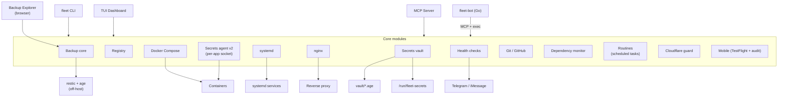
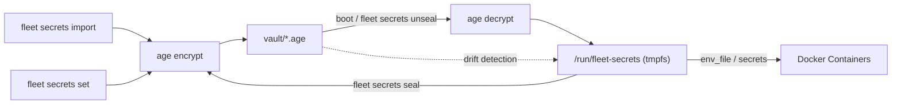
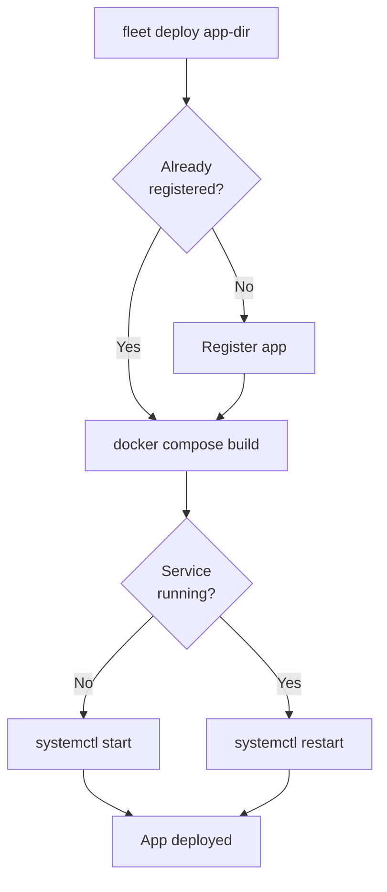

<div align="center">

# fleet

[](https://auto-audit.hesketh.pro)

**Docker production management CLI + MCP server**

[](https://github.com/wrxck/fleet/actions/workflows/ci.yml)
[](https://www.npmjs.com/package/@matthesketh/fleet)
[](https://nodejs.org)
[](https://www.typescriptlang.org/)
[](LICENSE)

Manage Docker Compose apps on a single server -- systemd orchestration, nginx routing, age-encrypted secrets, health monitoring, dependency tracking, Git workflows, and an MCP server for AI-assisted operations.

[Documentation](https://fleet.hesketh.pro) -- [npm](https://www.npmjs.com/package/@matthesketh/fleet) -- [GitHub](https://github.com/wrxck/fleet)

</div>

---

## Architecture



Each Docker Compose app is registered with its compose path, domains, port, and container names. Fleet generates systemd units so apps start on boot in the correct order. Secrets are encrypted at rest with [age](https://github.com/FiloSottile/age) and either decrypted to a tmpfs on boot (v1) or served per-app over a Unix socket by the secrets agent (v2).

Operator-specific identity (GitHub org, home dir, domain, username) lives in `data/operator.json` — gitignored, instance-local. Copy `data/operator.example.json` to seed it on a fresh install.

## Install

```bash
npm install -g @matthesketh/fleet
```

Requires Node.js 20+, Docker Compose v2, systemd, nginx, and [age](https://github.com/FiloSottile/age). See the [full setup guide](https://fleet.hesketh.pro/getting-started/) for details.

## Key Features

**Deploy and manage apps** -- `fleet deploy <app-dir>` registers, builds, and starts an app in one command. Control services with `start`, `stop`, `restart`, and `logs`.

**Encrypted secrets** -- age-encrypted vault with automatic backups, pre-seal validation, drift detection, and atomic rollback. Decrypted to tmpfs at boot -- secrets never touch disk.

**Nginx routing** -- Generate proxy, SPA, or Next.js server blocks with `fleet nginx add`. Automatic config testing and reload.

**Health monitoring** -- Three-layer checks (systemd + container + HTTP) with `fleet health`. The `watchdog` command runs on cron and sends alerts on failure.

**Dependency scanning** -- Detects outdated packages, CVEs (via OSV), Docker image updates, and runtime EOL across all registered apps.

**Git workflows** -- Onboard apps to GitHub, manage branches, PRs, and releases from the CLI.

**Off-host backups** -- `fleet backup` runs restic against an append-only REST backend with age-encrypted dumps for databases. Includes `schedule` for systemd-timer-driven recurring backups, `verify` / `integrity` for repository checks, and `serve` for a browser-based restore explorer.

**Routines** -- `fleet routines` is a TUI for signal-based scheduled tasks (each routine has a target repo, a trigger condition, and a runner — claude-cli, shell, or mcp). `fleet routine-run --id <id>` is the headless entrypoint for systemd-timer units.

**Mobile pipelines** -- `fleet testflight` dispatches the macOS build workflow and publishes to TestFlight; `fleet audit` runs an App Store Review Guidelines audit via greenlight.

**Cloudflare guard** -- `fleet guard` installs a watchdog layer (cf-snapshot, dns-drift-watch, cert-expiry-watch, cf-audit-monitor) that detects unauthorised dashboard changes and DNS drift on protected zones.

**Interactive dashboard** -- Run bare `fleet` to launch a full-screen TUI with real-time status.

See the [CLI reference](https://fleet.hesketh.pro/cli/) for the complete command list.

## Secrets Flow



Secrets are imported or set individually, encrypted with age, and stored in the vault. On boot (or manually), they are decrypted to a tmpfs mount that Docker containers reference. Sealing writes runtime changes back to the vault. Drift detection compares vault vs runtime to catch unsaved changes.

### Per-app secrets agent (v2, opt-in)

The v1 model decrypts every app's secrets to `/run/fleet-secrets/<app>/`, which means any process on the host can read the tmpfs file. v2 replaces that with a per-app systemd-templated socket service:

- Each app gets its own age keypair; the vault is encrypted to (admin + per-app) recipients.
- `fleet-secrets-agent@<app>.service` runs under `DynamicUser=yes`, loads the per-app key via `LoadCredentialEncrypted`, and serves the decrypted env over a Unix socket at `/run/fleet-secrets/<app>.sock`.
- Consumers (the container) fetch secrets via HTTP/1.1 over the socket. The [`@matthesketh/fleet-secrets-client`](https://www.npmjs.com/package/@matthesketh/fleet-secrets-client) package wraps that protocol for Node apps.
- `fleet secrets migrate-v2 <app>` orchestrates the move: snapshot, generate per-app keypair, re-encrypt to the new recipient set, edit the compose file + app unit, swap, and auto-rollback on any failure.
- `fleet secrets revert-v2 <app>` rolls back from a snapshot if you need to drop back to v1.

### Per-secret rotation (v1.6)

Each secret carries metadata (`lastRotated`, `provider`, `strategy`) so fleet knows when it's stale and how to safely rotate it.

```
fleet secrets ages [<app>]            # what's stale, who owns it, when last rotated
fleet secrets ages --motd             # MOTD-formatted summary
fleet secrets motd-init               # install /etc/update-motd.d/99-fleet-secrets

fleet secrets rotate <app> [<KEY>]    # interactive walkthrough, [--dry-run] [--no-restart]
fleet secrets rollback <app>          # restore latest snapshot, [--to <ts>]
fleet secrets snapshots <app>         # list available snapshots
fleet secrets rotate-key              # legacy: rotate the AGE master key
```

Rotation strategies (auto-detected from secret name, see `src/core/secrets-providers.ts`):

| Strategy | Examples | Behaviour |
|---|---|---|
| `immediate` | `STRIPE_SECRET_KEY`, `GITHUB_TOKEN`, `OPENAI_API_KEY` | Replace value, old dies |
| `dual-mode` | `JWT_SECRET`, `NEXTAUTH_SECRET`, `SESSION_SECRET` | New becomes primary, **old kept as `<NAME>_PREVIOUS`** so existing user sessions stay valid through grace period (your app must read both for verification) |
| `at-rest-key` | `ENCRYPTION_KEY`, `FIELD_ENCRYPTION_KEY` | Refused unless `--data-migrated` passed (you must re-encrypt stored data first) |
| `user-issued` | `USER_API_TOKEN`, `CUSTOMER_API_KEYS` | Refused — rotate per-user inside your app |

Safety rails on every rotation:
- Pre-rotation snapshot to `vault/.snapshots/<app>-<ts>.env.age` (atomic copy+rename)
- Hidden input prompt; new value never echoed in full (only `prefix…suffix (N chars)` for confirmation)
- Format validation against provider regex (catches paste typos)
- Entropy check rejects placeholders (`changeme`, `password`, all-same-char, < 8 chars)
- Auto-rollback on any failure during reseal
- Restart + 5s healthcheck gate after re-unseal; manual `fleet rollback` always available
- Append-only audit log at `~/.local/share/fleet/audit.jsonl` (mode 0600, never logs values)

### Log lifecycle (v1.6)

```
fleet logs setup <app>                # interactive: retention/size/level
fleet logs setup --all                # bulk default (7d / 100MB / info)
fleet logs status [<app>]             # per-container size, driver, policy applied
fleet logs prune <app>                # vacuum journald + truncate runaway json-file logs
fleet logs <app> --since 30m --grep err --level warn   # filtered tail
```

`fleet logs setup` writes `<composePath>/.fleet/logging.override.yml` with json-file driver options for rotation. To activate, include the override in your compose start command (or fleet's systemd unit).

MCP tools — all token-conservative with small defaults and `truncated` flags:
- `fleet_logs_recent(app, lines=50, level=warn, sinceMinutes=15)` — bounded tail
- `fleet_logs_summary(app, sinceMinutes=60)` — counts + top 10 distinct error messages
- `fleet_logs_search(app, query, sinceMinutes=60, maxResults=20)` — bounded grep
- `fleet_logs_status(app?)` — driver + size per container
- `fleet_egress_snapshot(app)` — outbound destinations + violations

### Egress observation (v1.6)

```
fleet egress observe <app>            # snapshot current outbound flows via nsenter+ss
fleet egress show <app>               # show config + allowlist
fleet egress allow <app> <host>       # add to allowlist (supports *.host wildcards)
```

v1 is **observe-only** — it never blocks packets, so zero risk of breaking apps. Reads each container's network namespace via `nsenter` so it sees real container egress (not just host-side NAT'd flows). Reverse-resolves remote IPs to hostnames best-effort. RFC1918 destinations don't count as violations.

`enforce` mode (actual default-deny via nftables) is deferred to a future phase — by design, it requires the operator to explicitly promote a shadow-clean app, never auto-promotes.

## Backups (off-host)

```
fleet backup init                          # initialise the restic repository
fleet backup register <app> [--paths …]    # tell fleet which paths and dbs to capture
fleet backup register-all                  # bulk-register every known app
fleet backup snapshot <app> [--tag …]      # take an on-demand snapshot
fleet backup snapshot-all                  # one snapshot per registered app
fleet backup list [<app>]                  # list snapshots, latest first
fleet backup restore <app> --snap <id> --target <dir>
fleet backup prune                         # apply retention policy
fleet backup verify                        # restic check (data integrity)
fleet backup integrity                     # repository integrity report
fleet backup schedule <app> --cron "..."   # install a fleet-backup@<app>.timer unit
fleet backup schedule-all                  # bulk-install timers from registered apps
fleet backup unschedule <app>              # remove the timer
fleet backup status [<app>]                # last-snapshot age, sizes, append-only state
fleet backup serve --port <n>              # browser-based restore explorer (see below)
fleet backup test                          # end-to-end snapshot+restore smoke
```

Snapshots go to a restic backend mounted with `append-only` mode so a compromised host can't delete history. Database dumps stream straight into the snapshot via `dumpFileSpawn`, never landing on disk in plaintext. Backups are encrypted twice — restic at rest, plus per-app age encryption inside the snapshot for anything classified as sensitive.

### Restore explorer

`fleet backup serve --port 7300` starts a localhost-bound HTTP service designed to live behind nginx. It serves:

- a read-only status dashboard at `/backups` showing the latest snapshot per app and any retention lag
- a tree explorer at `/backups/explore` for browsing snapshot contents
- a per-file streaming endpoint that pipes `restic dump` straight to the browser
- a one-click restore into a fresh timestamped staging dir under `/var/restore`

Authentication is **TOTP only** — paste the secret into your authenticator app on setup (`fleet backup setup-totp`). Sessions are signed cookies (`fleet_backup_session`), `Secure; HttpOnly; SameSite=Strict; Path=/backups`. Sensitive paths (`.env`, age keys, private SSH keys) are classified server-side and refuse view/download regardless of who's logged in.

CSRF posture: every `/api/*` request must carry `x-fleet-backup: 1` (a custom header browsers can't set cross-origin without preflight), and write methods (POST / DELETE) must additionally carry an `Origin` header whose host matches the deployment domain exactly. Read methods tolerate a missing `Origin` so curl probes still work.

## Routines

`fleet routines` is a TUI for signal-based scheduled tasks. Each routine has:

- a **target repo** the routine operates against
- a **trigger condition** (signals: open issues count, failing checks, branch ahead of remote, custom git-clean signal, scheduled, manual)
- a **runner**: `claude-cli` (drives a Claude Code session), `shell` (just runs a script), or `mcp-call` (invokes one MCP tool)
- a **schema** that validates inputs before the runner sees them

Routines run from a systemd-timer-driven service called `fleet-routine@<id>.timer` — fleet ships the templates and `fleet routine-run --id <id>` is the headless entrypoint that timer fires. The TUI shows a signals grid (which routines are gated on what), a routine list, and per-routine run history.

```
fleet routines                                   # interactive TUI
fleet routine-run --id <id> [--target <repo>] [--trigger scheduled] [--json]
```

The claude-cli runner serialises through a `proper-lockfile` mutex so two routines targeting the same repo can't race each other, and respects an abort signal so a `systemctl stop` cleans up mid-run rather than orphaning a child process.

## Mobile pipelines

For iOS/macOS apps, fleet drives both the build pipeline and the App Store compliance check.

### TestFlight publishing

```
fleet testflight publish <app>              # dispatch the macOS build workflow to TestFlight
fleet testflight builds <app>               # list TestFlight builds for the app
fleet testflight update <app> --build <id> --whats-new "..."
fleet testflight delete <app> --build <id>  # expire a TestFlight build
fleet testflight doctor <app>               # check gh + App Store Connect credentials
```

The publish flow goes through a GitHub Actions macOS runner — fleet dispatches the workflow with the app's bundle ID and version, then polls until the build appears in App Store Connect. Auth uses an API key (issuer + key ID + p8) loaded via a fleet-managed secret.

### App Store compliance audit

```
fleet audit [target]                        # run greenlight against a mobile project
fleet audit guidelines                      # browse App Store Review Guidelines (list/show/search)
fleet audit doctor                          # check the greenlight binary is installed
fleet audit ignore "<title>" --reason "..." # suppress a greenlight false positive
fleet audit ignores                         # list audit ignore rules
```

Greenlight runs a corpus of App Store Review Guideline checks against the project source. Findings classified as "confirmed false positive" are suppressed via the ignore list so the next run is noise-free; everything else fails the audit. Useful as a pre-flight before each TestFlight publish.

## Cloudflare guard

`fleet guard` installs a watchdog layer that detects unauthorised dashboard changes and DNS drift on protected Cloudflare zones.

```
sudo fleet guard install                    # install scripts + cron + log rotation
fleet guard status                          # show what's protected and the last check time
fleet guard approve <change-id>             # acknowledge a flagged change as intentional
fleet guard reject <change-id>              # treat a flagged change as compromise
```

Components installed under `/usr/local/sbin`:

- **`cf-snapshot`** — periodic snapshot of the Cloudflare zone configuration (DNS, page rules, WAF settings) to `/var/lib/cf-snapshots/`
- **`cf-audit-monitor`** — diffs the latest snapshot against the previous and surfaces unauthorised changes for operator approval
- **`dns-drift-watch`** — detects when DNS records drift from the snapshot (cron, alerts via the same channels as `fleet watchdog`)
- **`cert-expiry-watch`** — flags certs approaching expiry across all protected hosts
- **`fleet-guard` / `fleet-guard-execute`** — the orchestrator + executor pair, run as the `fleet-guard` system user with no shell

## Deployment Flow



## Boot Refresh

On every systemd start — including reboots — Fleet pulls the latest code from GitHub and rebuilds the image if needed, before starting the container. The flow is entirely fail-safe: any failure at any step (dirty working tree, no remote, fetch error, non-fast-forward merge, build failure, or a 900-second wall-clock timeout) is logged and falls through to a plain `docker compose up` with the existing image. The container will always start.

**New commands**

| Command | Description |
|---------|-------------|
| `fleet boot-start <app>` | Entry point systemd now invokes (`ExecStart`). Runs refresh then `docker compose up`. Not typically run by hand. |
| `fleet rollback <app>` | Re-tags `<image>:fleet-previous` → `<image>:latest` and restarts the service. Fleet tags the previous image automatically before every build. |
| `fleet patch-systemd` | Rewrites `ExecStart` in all installed unit files to use `fleet boot-start`, sets `TimeoutStartSec=900`, and backs up originals to `<path>.service.bak`. |
| `fleet patch-systemd --rollback` | Restores all `.bak` unit files and runs `daemon-reload`. |

**Kill switch**

To disable boot refresh entirely — next `systemctl start` goes straight to `docker compose up`:

```bash
sudo touch /etc/fleet/no-auto-refresh
```

Remove the file to re-enable.

**Registry field: `lastBuiltCommit`**

Each app in the registry stores the Git commit that was last built. Fleet sets this on `fleet deploy` and on every successful boot-refresh build. Boot refresh skips `docker compose build` when HEAD already matches this value, keeping boots fast when no code has changed.

**First boot after upgrade**

Any app with `lastBuiltCommit` unset will trigger a full rebuild the first time it boots after upgrading to this version. Expect a longer first boot for those apps.

**Recovery escape hatches**

| Situation | Action |
|-----------|--------|
| One app misbehaving after a build | `fleet rollback <app>` |
| Registry corrupted | Auto-loads `.bak` on next read |
| Broad issue with boot-start behaviour | `sudo touch /etc/fleet/no-auto-refresh` |
| Worst case — revert all unit files | `fleet patch-systemd --rollback` |

## MCP Server

Fleet exposes 50+ tools via the [Model Context Protocol](https://modelcontextprotocol.io/) for AI-assisted server management — the static surface (server.ts + git / secrets / deps / audit / testflight tool families) plus every migrated registry command exposed through the registry bridge. Run `fleet mcp` to start the stdio server, or install it into Claude Code:

```bash
sudo fleet install-mcp
```

Tools cover the full surface area: app lifecycle, secrets, nginx, Git, health checks, and dependency monitoring. See the [MCP documentation](https://fleet.hesketh.pro/mcp/) for the complete tool list.

## fleet-bot

A Go companion bot (`bot/`) that provides remote server management through Telegram or iMessage. It runs Claude Code sessions with access to fleet's MCP tools for hands-free operations.

See the [bot documentation](https://fleet.hesketh.pro/bot/setup/) for setup instructions.

## Self-update

When `fleet`'s TUI launches it does a non-blocking `git fetch` against the configured update channel and compares HEAD to that remote branch. If the local repo is behind, a banner appears under the header:

```
↑ Update available: 3 commits ahead — feat: ... Press U to install.
```

Pressing `U` runs `git pull --ff-only origin <channel-branch>` then `npm run build` (refused if the working tree is dirty). The new binary is live for the next `fleet …` invocation. Recheck happens every 30 minutes for long-running TUI sessions.

**Channels**

| channel | tracks | who it's for |
|---|---|---|
| `stable` (default) | `origin/main` — tagged releases only | everyone |
| `prerelease` | `origin/develop` — work in flight, may break | operators willing to canary |

Opt into prerelease for the current process:

```bash
FLEET_UPDATE_CHANNEL=prerelease fleet
```

Or persist it (e.g. in `~/.bashrc` or the systemd unit's `Environment=`):

```bash
export FLEET_UPDATE_CHANNEL=prerelease
```

When the banner is on the prerelease channel it labels itself `↑ Update available (prerelease): …` so you can tell at a glance.

**Escape hatch — track an arbitrary branch**

For forks or release branches, `FLEET_UPDATE_BRANCH=<name>` overrides the channel entirely:

```bash
FLEET_UPDATE_BRANCH=release/2026.q3 fleet
```

## Testing

```bash
npm test                     # unit + mocked tests (~1720 passing)
FLEET_INTEGRATION=1 npm test # also runs boot-refresh + secrets-v2 integration tests
```

Set `FLEET_INTEGRATION=1` to opt into integration tests that hit real systemd / docker. Skipped by default in CI.

## Development

```bash
git clone https://github.com/wrxck/fleet.git
cd fleet
npm install
npm test          # vitest
npm run build     # compile TypeScript to dist/
npm run dev       # run with tsx (no build needed)
```

## License

MIT
