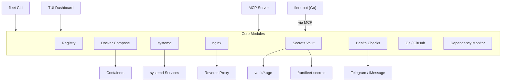
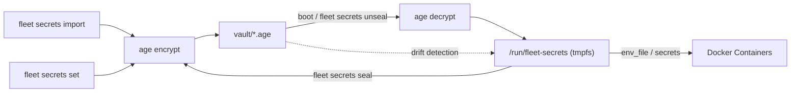
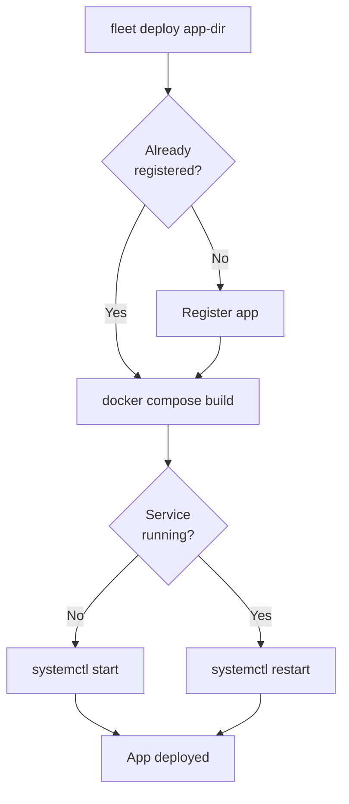

<div align="center">

# fleet

[](https://auto-audit.hesketh.pro)

**Docker production management CLI + MCP server**

[](https://github.com/wrxck/fleet/actions/workflows/ci.yml)
[](https://www.npmjs.com/package/@matthesketh/fleet)
[](https://nodejs.org)
[](https://www.typescriptlang.org/)
[](LICENSE)

Manage Docker Compose apps on a single server -- systemd orchestration, nginx routing, age-encrypted secrets, health monitoring, dependency tracking, Git workflows, and an MCP server for AI-assisted operations.

[Documentation](https://fleet.hesketh.pro) -- [npm](https://www.npmjs.com/package/@matthesketh/fleet) -- [GitHub](https://github.com/wrxck/fleet)

</div>

---

## Architecture



Each Docker Compose app is registered with its compose path, domains, port, and container names. Fleet generates systemd units so apps start on boot in the correct order. Secrets are encrypted at rest with [age](https://github.com/FiloSottile/age) and decrypted to a tmpfs on boot.

## Install

```bash
npm install -g @matthesketh/fleet
```

Requires Node.js 20+, Docker Compose v2, systemd, nginx, and [age](https://github.com/FiloSottile/age). See the [full setup guide](https://fleet.hesketh.pro/getting-started/) for details.

## Key Features

**Deploy and manage apps** -- `fleet deploy <app-dir>` registers, builds, and starts an app in one command. Control services with `start`, `stop`, `restart`, and `logs`.

**Encrypted secrets** -- age-encrypted vault with automatic backups, pre-seal validation, drift detection, and atomic rollback. Decrypted to tmpfs at boot -- secrets never touch disk.

**Nginx routing** -- Generate proxy, SPA, or Next.js server blocks with `fleet nginx add`. Automatic config testing and reload.

**Health monitoring** -- Three-layer checks (systemd + container + HTTP) with `fleet health`. The `watchdog` command runs on cron and sends alerts on failure.

**Dependency scanning** -- Detects outdated packages, CVEs (via OSV), Docker image updates, and runtime EOL across all registered apps.

**Git workflows** -- Onboard apps to GitHub, manage branches, PRs, and releases from the CLI.

**Interactive dashboard** -- Run bare `fleet` to launch a full-screen TUI with real-time status.

See the [CLI reference](https://fleet.hesketh.pro/cli/) for the complete command list.

## Secrets Flow



Secrets are imported or set individually, encrypted with age, and stored in the vault. On boot (or manually), they are decrypted to a tmpfs mount that Docker containers reference. Sealing writes runtime changes back to the vault. Drift detection compares vault vs runtime to catch unsaved changes.

## Deployment Flow



## MCP Server

Fleet exposes 36 tools via the [Model Context Protocol](https://modelcontextprotocol.io/) for AI-assisted server management. Run `fleet mcp` to start the stdio server, or install it into Claude Code:

```bash
sudo fleet install-mcp
```

Tools cover the full surface area: app lifecycle, secrets, nginx, Git, health checks, and dependency monitoring. See the [MCP documentation](https://fleet.hesketh.pro/mcp/) for the complete tool list.

## fleet-bot

A Go companion bot (`bot/`) that provides remote server management through Telegram or iMessage. It runs Claude Code sessions with access to fleet's MCP tools for hands-free operations.

See the [bot documentation](https://fleet.hesketh.pro/bot/setup/) for setup instructions.

## Development

```bash
git clone https://github.com/wrxck/fleet.git
cd fleet
npm install
npm test          # vitest
npm run build     # compile TypeScript to dist/
npm run dev       # run with tsx (no build needed)
```

## License

MIT
