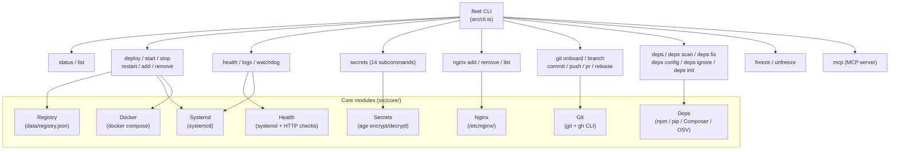
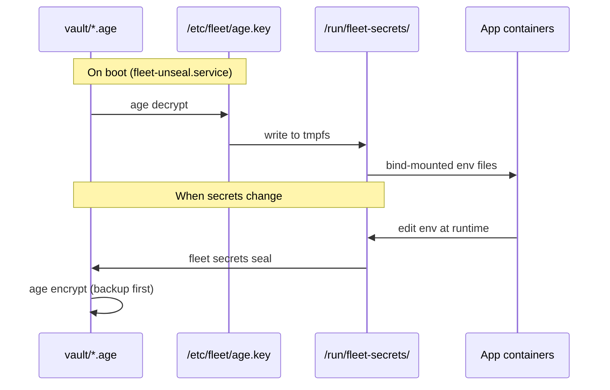
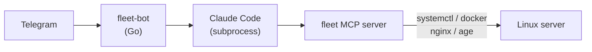

## CLI architecture



## Key paths

| Path | Purpose |
|------|---------|
| `data/registry.json` | App inventory — compose paths, domains, port, container names |
| `vault/*.age` | Encrypted secrets, one file per app |
| `/etc/fleet/age.key` | age private key (root-owned, mode 600) |
| `/run/fleet-secrets/` | Decrypted secrets at runtime (tmpfs, lost on reboot) |
| `/etc/fleet/notify.json` | Watchdog alert configuration (Telegram) |
| `/etc/systemd/system/<app>.service` | Generated systemd unit for each app |
| `/etc/nginx/sites-available/<domain>.conf` | Generated nginx server blocks |

## Secrets lifecycle

Secrets follow a one-way pipeline from vault to runtime, with the option to seal changes back:



## fleet-bot (Go Telegram bot)

The `bot/` directory contains a separate Go program that provides remote server management through Telegram chat. It runs Claude Code sessions with access to fleet's MCP tools.



The bot runs as a systemd service and is built and deployed separately from the main CLI:

```bash
cd bot
make build
sudo cp fleet-bot /usr/local/bin/
sudo systemctl enable --now fleet-bot
```
